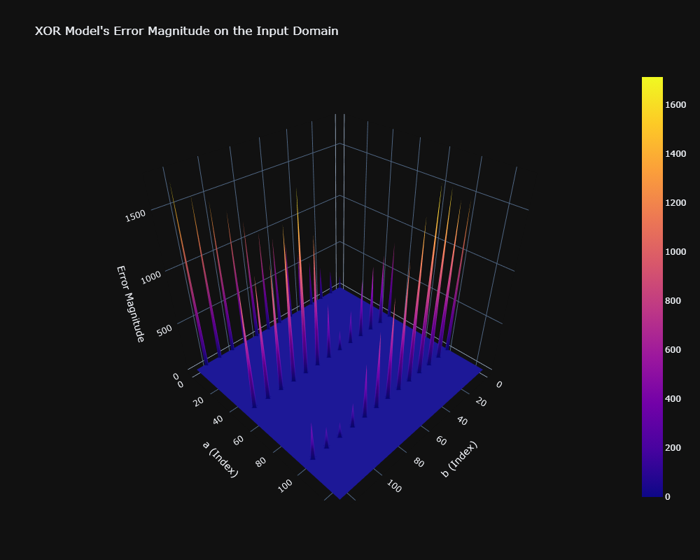
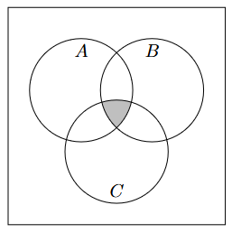

## "My algorithm doesn't consider x, so it cannot discriminate according to it."
That's not true. Machine Learning is all about predicting hidden variables (sometimes called labels) with a given set of variables. It is definitely possible that a model can pick up on discriminatory patterns that are not explicitly built into it's architecture.

Don't take my word for it, this is data science, if I'm trying to convince you of something then I should be able to give you a reproducible set of instructions in order to prove that what I'm saying is true, so here you go:

&nbsp;&nbsp;&nbsp;&nbsp;&nbsp;&nbsp;**\#1.** Generate a dataset of numbers [[$a_1, b_1$], [$a_2$, $b_2$], ...] such that $a$ and $b$ are random unsigned integers not divisible by 5.

&nbsp;&nbsp;&nbsp;&nbsp;&nbsp;&nbsp;**\#2.** Define and train a neural net such that, when given $a$ and $b$ it tries to predict $a$ XOR $b$. [(Bitwise XOR)](https://en.wikipedia.org/wiki/Bitwise_operation). Make sure it is sufficiently complex, I'd say at least $(2 \rightarrow 2 \rightarrow 2 \rightarrow 1)$, What I used was $(2 \rightarrow 16 \rightarrow 16 \rightarrow 1)$.

&nbsp;&nbsp;&nbsp;&nbsp;&nbsp;&nbsp;**\#3.** Algorithmically test the model on many different combinations of inputs and outputs, keeping track of which ones the model has the most trouble with.

When I attempted this, here were my findings:



As you can see the model is a lot worse at predicting outputs on inputs that are divisible by 5. In other words, the model discriminates against certain *kinds* of numbers, even though it's input type is non-discriminatory (it takes 2 of any integer, it doesn't take the kind of integer into consideration). This is obviously because in step \#1 we made sure that the data did not include any integers divisible by 5, but nonetheless proves that the original claim is false.

---
## "The data is anonymized, so everyone's right to confidentiality has been preserved."
This isn't necessarily true. The best example that I've seen of this is an [animal classification dataset](https://www.kaggle.com/datasets/uciml/zoo-animal-classification/data) that my professor showed me. The data could be anonymized and rewritten like this:

| id   | hair | feathers | eggs | milk | airborne | aquatic | predator | toothed | backbone | breathes | venomous | fins | legs | tail | domestic | catsize | class_type |
|------|------|----------|------|------|----------|---------|----------|---------|----------|----------|----------|------|------|------|----------|---------|------------|
| 1193 | 0    | 0        | 1    | 0    | 0        | 1       | 1        | 1       | 1        | 0        | 0        | 1    | 0    | 1    | 0        | 1       | 4          |
| 1226 | 0    | 1        | 1    | 0    | 1        | 0       | 1        | 0       | 1        | 1        | 0        | 0    | 2    | 1    | 0        | 0       | 2          |
| 1240 | 0    | 1        | 1    | 0    | 1        | 1       | 0        | 0       | 1        | 1        | 0        | 0    | 2    | 1    | 0        | 1       | 2          |
| 1278 | 0    | 0        | 1    | 0    | 0        | 1       | 1        | 1       | 1        | 0        | 0        | 1    | 0    | 1    | 0        | 1       | 4          |
| 1313 | 1    | 0        | 0    | 1    | 0        | 0       | 0        | 1       | 1        | 1        | 0        | 0    | 4    | 1    | 1        | 1       | 1          |

As you can see, there is nothing that directly identifies which row is which animal, only the features of each animal. However, if you are clever you are able to roughly deduce the identity of each animal. Take this row for example:

| id   | hair | feathers | eggs | milk | airborne | aquatic | predator | toothed | backbone | breathes | venomous | fins | legs | tail | domestic | catsize | class_type |
|------|------|----------|------|------|----------|---------|----------|---------|----------|----------|----------|------|------|------|----------|---------|------------|
| 3051 | 0    | 0        | 1    | 0    | 0        | 1       | 1        | 0       | 0        | 0        | 0        | 0    | 5    | 0    | 0        | 0       | 7          |

What animal can you think of with five legs? I couldn't think of any, so I looked it up. It turns out that the only animals that are aquatic and have five legs are certain kinds of starfish. So we have successfully deduced the identity of id 3051, it is a starfish. 

While it may not always be easy to tell what an animal *is*, it's usually easy to tell what it's *not*. Here's another example

| id   | hair | feathers | eggs | milk | airborne | aquatic | predator | toothed | backbone | breathes | venomous | fins | legs | tail | domestic | catsize | class_type |
|------|------|----------|------|------|----------|---------|----------|---------|----------|----------|----------|------|------|------|----------|---------|------------|
| 1442 | 1    | 0        | 0    | 1    | 0        | 0       | 1        | 1       | 1        | 1        | 0        | 0    | 2    | 0    | 1        | 1       | 1          |

Where $A$ is the set of animals, $B$ is the set of non-aquatic animals, and $C$ is the set of non-airborne animals, $A \cap B \cap C$ contains the set of possible animals for this row. You can continue this process with all of the variables until the intersection is as small as it can possibly be.



What if instead, this data consisted of:
```
id, var1, var2, var3, var4, var5, embarrassingSecret
```
And in a similar manner to the starfish, we deduce from var1 through var5 that a certain id is you, the reader? Would you say your right to confidentiality has been preserved?

---

## "Maybe AI systems are imperfect, but so are humans.  AI reduces bias compared to human decision-making."

&nbsp;&nbsp;&nbsp;&nbsp;&nbsp;&nbsp;Again, this isn't necessarily true. AI *can* reduce bias, but it can also exacerbate existing human bias, or create new bias of its own. There is a good example of this given in the first FAQ. If you taught a human how to compute bitwise XORs, they would likely be significantly less biased against numbers divisible by five than the model is. It's true that a *good* XOR predicting neural net could be less biased than a human, but nonetheless, AI doesn't necessarily reduce bias compared to humans.

---

## "AI is bad"

If you said "chatGPT is bad" I would disagree with you, but I wouldn't be able to say 100% confidently and intellectually honestly that you are wrong. It's an opinion that I think is tenable, and I would respect it.

If you said "AI is bad" you would be wrong in the sense that there exists AI that is *not* bad, but correct in the sense that there exists AI that *is* bad. That's the problem, AI gets lumped into one big category when it's form and purpose is so unbelievably diverse. AI is gaining an increasingly negative connotation because of associations to things like cheating students, spam emails, unwanted features in certain products (why is my toothbrush being advertised as an "AI" toothbrush?), sci-fi movies, uncanny valley robots, and many legitimately bad and harmful implementations of AI.

AI is a tool, and saying AI is bad because it was used to do a certain bad thing is as good of a conclusion as saying screwdrivers are bad because they have been used to make bombs.

Because you rarely hear about them, here's a list of implementations of AI that are certainly good by almost all accounts:
- E-mail spam filters: Email would be unusable if it weren't for AI systems that automatically pick out spam messages for you.
- Certain medical applications: Certain AI systems in the medical field allow doctors and surgeons to do things they otherwise wouldn't be able to do such as see into peoples brains during surgery and detect cancer extremely early. The end result is lives being saved.
- Chess AI: Provides chess players with important analysis that helps them improve, such as which move is bad, why, and what move might be better.
- Spellcheckers: Helps humans communicate quicker, clearer, and more efficiently. While they can sometimes be annoying, you can basically always turn them off if you'd prefer.