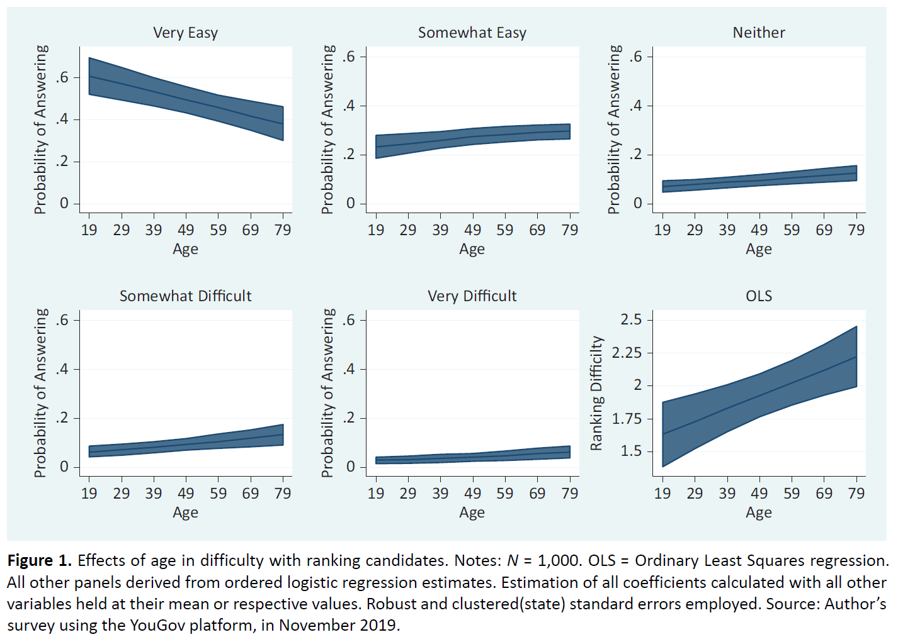
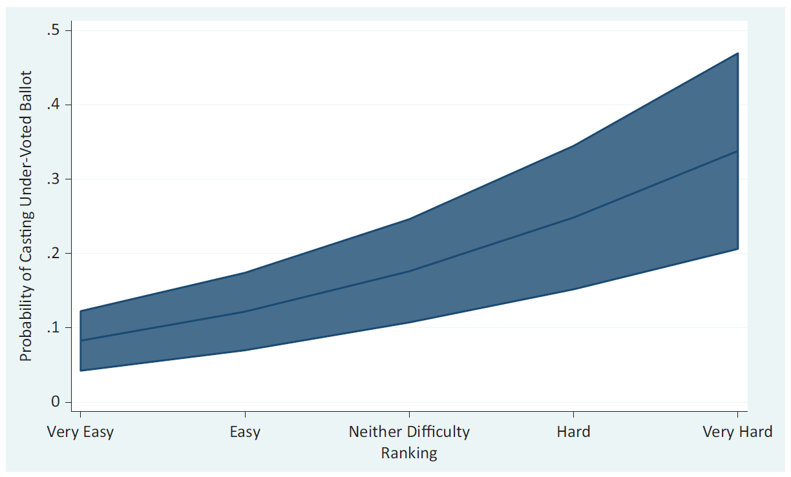

## Info/Misc:
- **RCV** stands for Ranked-Choice Voting, a kind of voting system where voters rank candidates in order of preference. **FPTP** stands for First Past The Post, a more traditional form of voting where voters submit a ballot indicating their #1 most preferred candidate.
- This page is for an assignment in MTH 2190 - Ethics in Data Science. The assignment is a case study regarding a modern data science article with some kind of ethical component. I chose an article on RCV, you can find the article [here](https://www.cogitatiopress.com/politicsandgovernance/article/view/3913).
- Another project I did relating to RCV and Data Science: [Project's GitHub.](https://github.com/rheffelman/ranked-choice-voting) It's an open source library for computing Ranked-Choice ballots I made in C++, with options for computing under as many different RCV systems as I could find.

---

## [Article](https://www.cogitatiopress.com/politicsandgovernance/article/view/3913) Summary:

&nbsp;&nbsp;&nbsp;&nbsp;The article looks at the main and in my opinion, the only real issue with RCV; its perceived difficulty relative to traditional voting. It breaks down the effects of this difficulty by certain demographics, to see if it disproportionately effects certain groups of people. After all, it would be quite unethical to implement a system that, for instance, is unintelligible to Democrats and crystal clear to Republicans.

### **Methods:**
- **Method 1:** They had many different people fill out hypothetical ranked-choice ballots and then had them pick a category representing how difficult they thought it was. Here's an example of what some of this data looks like:

(Coll, 2021, p.299) 
Note: They collected many more variables than just age, they collected things like gender, race, education, political beliefs, etc.

- **Method 2:** They collected other data on events they assumed might be associated with RCV's difficulty such as the prevalence of under-voting (voters not indicating their preferred rank of ALL candidates) and over-voting (For example, a voter ranking 2 candidates as their #1 most preferred candidate).

### **Conclusions:**
- They found that only `age` and `difficulty ranking candidates` are significant predictors of under-voting. Here's a plot of the relationship they found:

(Coll, 2021, p.303) 
- They didn't find the evidence to support that any particular racial, ethnic, or socioeconomic groups find RCV to be more difficult than any other.

---

## What I Believe The Article Does Well:

- Almost every counterpoint I can think to bring up is acknowledged to some extent in the article, almost every hole that I will poke through their article has been pre-poked by them, it is very thorough and well rounded.
- Their data and methods of analysis are quite good, we're fortunate that the dataset they used exists as it provides a ton of insight.

---

## What I Believe The Article Does Poorly:

### 1. A data-oriented problem:

"*Further, these difficulties have been assumed to cause individuals to improperly fill out RCV ballots, such as ranking too many or not enough candidates.*" (Coll, 2021, p.293).

- I believe this causal relationship and conclusion may be ill-formed for the following reasons:
    1. Under-voting can be a perfectly reasonable action, even for parties who have no difficulties with and a profound understanding of RCV. For instance, if you ask someone to rank two candidates whom they have never heard of before, they might abstain from ranking them instead of placing them in some arbitrary order.
    
    2. The dataset is biased such that the type of voters described in the bullet above are significantly less prevalent than they would be in an actual election. This is because **they asked only Democrats to rank a list of the most famous Democrat politicians** in the country. Democrats were asked to rank [randomized: Joe Biden, Pete Buttigieg, Kamala Harris, Bernie Sanders, and Elizabeth Warren] (Coll, 2021, p.296). I believe it's reasonable that Democrats might have a stronger and better informed opinion on Democrat politicians than they would about politicians as a whole, thus less likely to abstain due to a lack of knowledge on the candidates.

    3. Because a significant portion of the kinds of voters who under-vote are missing from the data, I don't think there is sufficient evidence to suggest this causal relationship.

### 2. A nitpicky definitional complaint:
-  I think it's wrong to qualify RCV as being *more* difficult than traditional voting. I think it's more correct to say RCV is *equally or more* difficult compared to FPTP. This is because the bare-minimum RCV ballot is directly convertible to an FPTP ballot, and any FPTP ballot is convertible to an RCV ballot.

- The set of FPTP ballots is a subset of the set of RCV ballots, so RCV ballots are either equivalent in complexity/difficulty, or they're more complex/difficult. This is significant because if an individual finds RCV too difficult, they can submit an FPTP ballot and still have their opinion taken into consideration (although that's a whole other ethical can of worms).

### 3. "*Difficulty*" might be used in two different senses:

- There's difficulty as in inherent complexity of the system. In RCV there are more boxes to check and more of your opinion to share. This *usually* results in a *more* complex system, although in my opinion, still not a particularly complex system.

- There's also difficulty in terms of the moral judgment voters are making. Sometimes, deciding who to vote for can be a **difficult** choice. I believe that this second form of difficulty is trivial and should not be viewed as a downside of RCV. If you extend that logic you could conclude that we should abolish voting altogether, as the mental effort of deciding who to vote for outweighs having the ability for the input of the people to be taken into consideration.

---

## References:

- 1. Coll, Joseph. "Demographic Disparities Using Ranked‐Choice Voting? Ranking Difficulty, Under‐Voting, and the 2020 Democratic Primary". Politics and Governance Volume 9 Issue 2 (2021): 293-305. [https://www.cogitatiopress.com/politicsandgovernance/article/view/3913](https://www.cogitatiopress.com/politicsandgovernance/article/view/3913) . 18 Jan. 2025.

- ChatGPT was used to assist in creating some of the web design for the site, all of the content on the site was created by me unless explicitly cited to have been created by someone else. I did this because I feel that the point of this assignment is the writing and content, not the fiddling around with HTML/CSS. I feel like it's an ethical use of the tool.

--- 