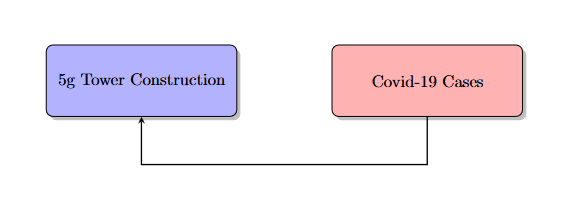

# 1.
### Correlations are relationships between two or more variables.  
That's it, just relationships.  
There's a relationship between each variable in every dataset ever created.  

Many correlations are completely and utterly meaningless.
Some, however, are not. One particularly useful kind of correlation
is a linear correlation.

# 2.
One of the most dangerous examples of confusing correlation with causation
that occured in my lifetime is the 5g Covid-19 conspiracy, caused by a real correlation
that some people believed to be causation.

&nbsp;&nbsp;&nbsp;&nbsp;Sorry for how blurry it is, this is one of the first ever social media posts
relating to this conspiracy theory, it has undoubtedly been shared around a ton and
lost image quality.

&nbsp;&nbsp;&nbsp;&nbsp;Essentially it highlights a correlation between the construction of 5g towers and covid-19
cases breaking out. Suspicious, right? Well no, it's clear that while the data does somewhat
correlate, you might **also** notice that the data correlates roughly with the population density
in the United States, as well as the locations of major cities. Doesn't it seem more plausible
that the people constructing 5g towers would focus on major cities so that they can reach the
most amount of people? And that major cities would have more covid-19 cases because they have
more people? To me, it seems absurd to conclude that this data implies that 5g towers cause
covid-19, but to other people, this was their actual belief that they took just as seriously as 
I do any of my beliefs. I'd wager that if the data existed, you could plot the number of people
who hold this belief against the construction of 5g towers, and using the same logic, conclude that
5g towers cause people to believe in the 5g covid-19 conspiracy.

&nbsp;&nbsp;&nbsp;&nbsp;Why is this belief dangerous? It affects peoples actions in relation to covid-19 which can easily
lead to more covid cases and more deaths. All it takes is 1 reckless sick person to spread the virus
to many more people, due to how viruses spread exponentially. Also it leads to a distrust in government,
which is sometimes a good thing, but I believe the government ought not to be trusted when they have broken
the publics trust, and in this case they haven't.

# 3. 

### The relationship could be modeled like this:

### However, equally as implied by the data is this model:

### I believe the truth is more likely to be something like this:

