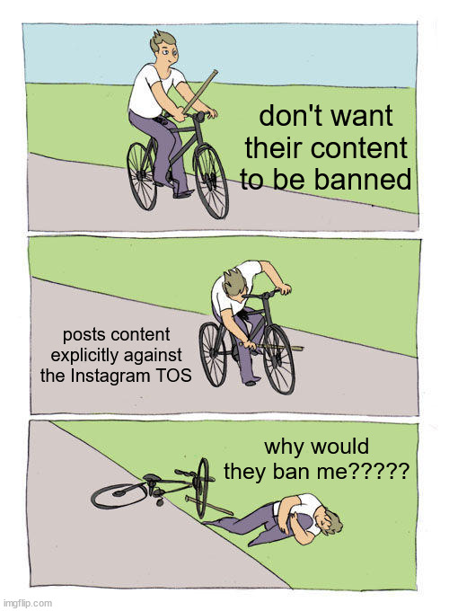
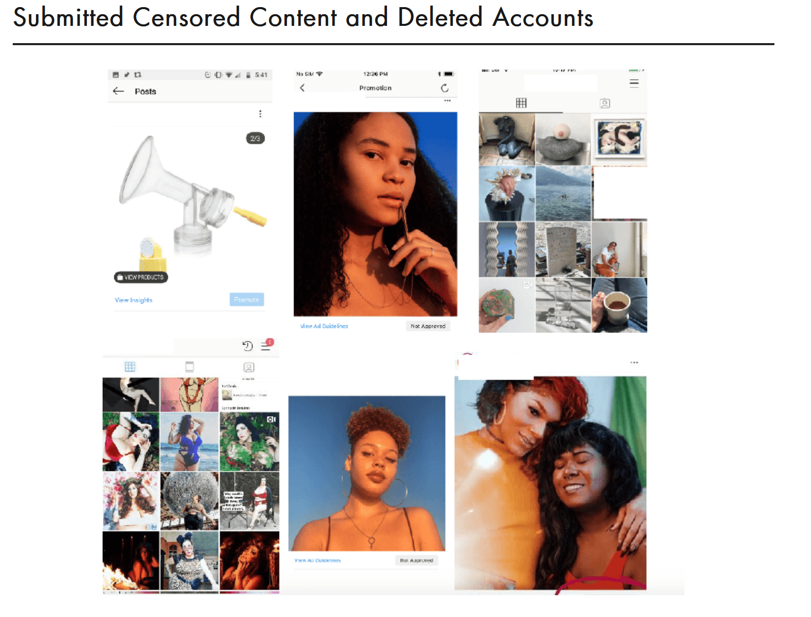

Ryan Heffelman 
1-21-2025 
Persuasive Writing 
MTH 2190 

# Is Instagram Sexist?
This article relies solely on anecdotal, loosely quantified, and inexact evidence from essentially a single source.

Isn't is possible that, if someone is changing their gender in order to trick the system into not flagging them, that they might also take other measures to avoid their content from getting flagged? Isn't it then possible that one of these other measures they took is what actually resulted in their perceived difference in treatment by the system?

From the article:
- “It’s really upsetting and ridiculous that women are having to change their gender [on Instagram] to avoid being censored,” said Carolina, a founding member of @everybodyvisible

If women want to avoid being censored, they should start by not posting obscene content that breaks the TOS of the platform they are using. What's upsetting and ridiculous is that women are trying to game the system in order to post obscene content without it getting censored.

They are breaking the rules, and then getting punished in accordance to the rules, and then complaining about it.

# Salty analysis
Unfortunately I also take issue with this article. They use data they gathered themselves, and the data is clearly extraordinarily biased. Just look at the demographics of the survey respondents contrasted with Instagram demographics:

- Around 50% of Instagram users are male, and yet about 10% of their survey respondents were men.
- About 1% of people in the world are sex workers, and yet about 30% of the people who responded to their survey are sex workers.

Frankly, sex workers are not the people I am worried about having their content wrongly removed from Instagram.

While I agree that nothing shown in these 6 images is obscene, I simply do not have the required context to make a proper judgment on these cases, because they have not given it (and sometimes literally hidden it). For just about every one of those images, I can envision a possible scenario in which it is completely justified for Instagram to have taken their content down. What if on the next image in the gallery on the top left there is a woman with her breasts out, using the pump pictured? What if in the bottom left, on another part of their profile, there is content that is clearly obscene? They conveniently crop important information and fail to cite sources, ensuring that you literally just have to take their word for it, and I do not take their word for it given how clearly biased the site is.